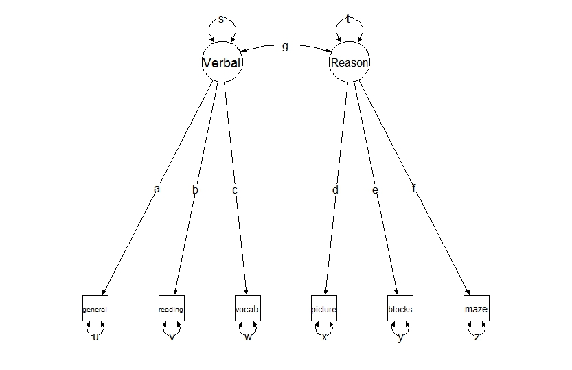
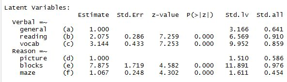
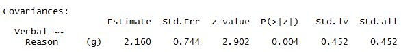
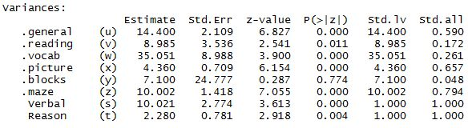
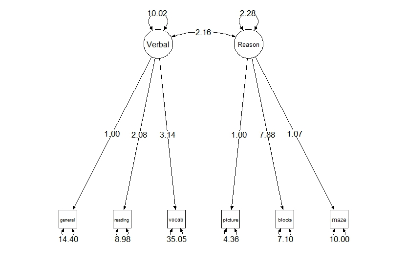
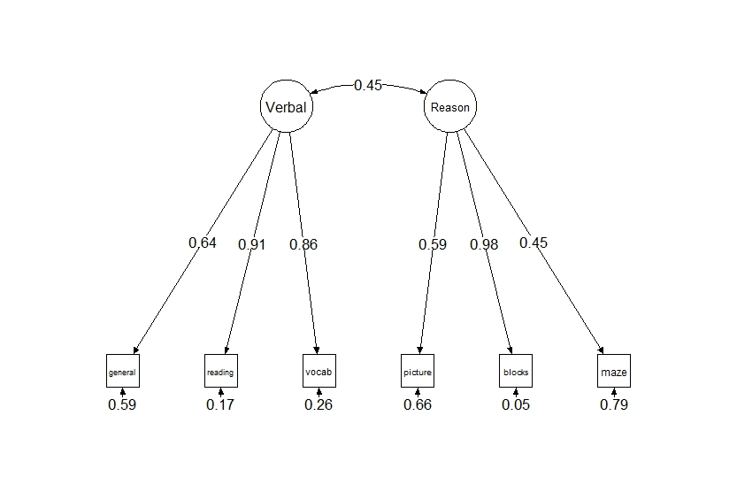
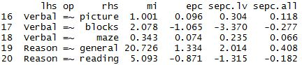
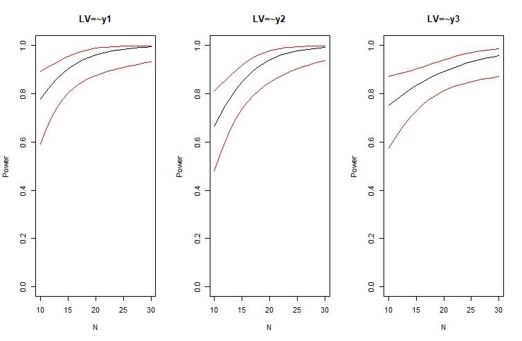

```{r setup, include=FALSE}
knitr::opts_chunk$set(echo = FALSE)
```

## Agenda

- Introduce the main concepts and jargon of Confirmatory Factor Analysis (CFA)
- How to implement in R
- How to interpret model output and compare models
- How to make some basic path diagrams

## What do we mean by "Factor"?

- Factors are latent variables that are impossible to measure directly (depression, compassion, intelligence, etc.)
- In CFA we hypothesize that factors influence observable variables, referred to as _manifest_ or _indicator_ variables
- Example: we can't "measure" reasoning, but perhaps we see it manifested in certain test scores
- In CFA, we usually think factors influence more than one variable _and account for the covariances (or correlations) among these variables_.

Alert! Factors often refer to categorical variables in regression and ANOVA. These are not the same!

## Example of correlation matrix

Six ability and intelligence tests were given to 112 individuals. This is the correlation matrix of their scores.


Perhaps there are factors such as verbal comprehension and fluid reasoning that explain the clusters of high correlations?

## CFA models a correlation/covariance matrix

* CFA allows us to propose a _specific model_ and fit it to the covariance matrix.
    + Example: general, reading and vocab are manifest variables for verbal comprehension, while the others are manifest variables for reasoning.
    
* The result of CFA is a model that can generate a covariance matrix. Ideally this covariance matrix will be similar to the original covariance matrix.

* Basic CFA assumes our data is multivariate Normal.

* Reminder: Exploratory Factor Analysis, or EFA, allows us to search for a certain number of factors. 
    + Are there one or more latent _constructs_, or factors, that explain clusters of high covariances?


## A CFA model

A CFA model is usually presented as a _path diagram_. We propose a model based on theory or prior research. Here is one possible model.





## Elements of a path diagram

- circles: unobserved latent factors
- boxes: observed manifest, or indicator, variables
- straight arrows: directional relationship
- curved double-headed arrows: non-directional relationship (variance/covariance)

## In the path diagram two slides back...

- Verbal and Reason are the unobserved factors
- The observed variables in boxes are influenced by the factors (indicated by the arrows)
- The labels **a** - **f** on the arrows are _loadings_ or coefficients that summarize how the manifest variables relate to the factors
- The curved arrow labeled **g** summarizes the _factor covariance_ 
- The curved arrows labeled **s** and **t** summarize _factor variance_
- The curved arrows labeled **u** - **x** indicate _error variance_; how much variability is _not_ due to the factors
- NOTE: some parameters are _fixed_ or _constrained_ to 0. For example, the covariance between `reading` and `vocab` is set to 0 (ie, there is no curved arrow connecting them)

## The goals of a CFA

- Estimate the loadings, error variances, and factor variances/covariance (ie, the labels in the path diagram)
- Evaluate if the model is "good" (just because we propose and fit it does not mean it's a good model)
- Perhaps attempt to improve the model
- Interpret the model
- Create a path diagram of model for publication or presentation

## CFA in R with `lavaan` and `semPlot`

### `lavaan`
- In this workshop we use the `lavaan` package to perform CFA. `lavaan` is an abbreviation of "latent variable analysis".
- Official site: http://lavaan.ugent.be/
- Still in beta but in active development and stable for CFA

### `semPlot`
- The `semPlot` package allows us to create path diagrams using fitted `lavaan` models within `R`
- Good for quickly creating path diagrams, but will likely need to fiddle to get it publication-ready


## Basic steps for using `lavaan`

0. Assess multivariate normality of data (if you have raw data)
1. Specify the model using `lavaan` model syntax 
2. Fit the model using the `cfa` function
3. Evaluate the model using functions such as `summary`, `fitted` and `residuals`
    + `summary`: CFA model output
    + `fitted`: fitted covariance matrix
    + `residuals`: difference between observed and fitted covariance matrix

## `lavaan` model syntax

- Model syntax is specified as a string enclosed by single quotes
- To specify the model a few slides back:

```
mod <- 'Verbal =~ general + reading + vocab
        Reason =~ picture + blocks + maze'
```
- The `=~` operator is used to define latent variables, or factors. The name of the factor is on the left of the `=~` operator, while the terms on the right, separated by `+`, are the indicators.
- We specify the factor names (`Verbal` and `Reason`); the indicator names should come from data loaded in R
- see `?model.syntax` for full documentation

## Fitting a `lavaan` model

- Once a model is defined, we fit it using the `cfa` function
- If data in data frame:
```
mod.fit <- cfa(mod, data = DataFrameName)
```
- If data is a covariance matrix, must also supply number of observations:
```
mod.fit <- cfa(mod, sample.cov = ability.cov, 
                    sample.nobs = 112)
```
- Once the model is fit, we can examine it:
```
summary(mod.fit, standardize = TRUE) 
fitted(mod.fit)
residuals(mod.fit)
```

- Let's go to R!

## Understanding a CFA model

After we fit a model we want to know...

- what does the `summary` output mean?
- is the model "good"?
- can we improve it?

We also may want to visualize as a path diagram.

## Summary output - model fit

The first section summarizes model fit.

```
  Estimator                                         ML
  Minimum Function Test Statistic               31.318
  Degrees of freedom                                 8
  P-value (Chi-square)                           0.000
```

- Says we used Maximum Likelihood (ML) to fit the model. 
- Minimum Function Test Statistic is the Chi-square goodness-of-fit statistic.
- The null is predicted variance-covariance matrix equals the sample variance-covariance matrix.
- A small p-value provides evidence against the null (ie, the model is not a good fit)

## Summary output - Latent Variables




- `Estimate`: unstandardized estimates, first variable constrained to equal 1 (one-unit increase in `Verbal` is associated with a 2.07 increase in `reading`)
- `Std.lv`: only latent factors standardized (one standardized unit increase in `Verbal` is associated with a 6.56 increase in `reading`)
- `Std.all`: manifest variables and latent factors standardized (one standardized unit increase in `Verbal` is associated with a 0.910 standardized unit increase in `reading`)

## Summary output - Latent Variables (cont'd)


- Manifest variables with a constrained estimate of 1 are called _marker_ variables
- This fixes the metric of the latent factor to be the same as the marker variable
- This is done because latent factors are unobserved and have no units by which to measure them
- The `Verbal` and `Reason` latent variables use the `general` and `picture` metrics, respectively


## Summary output - Covariances




- The covariance of the two latent factors is estimated to be 2.16
- The correlation of the two latent factors is estimated to be 0.452 
- The standard deviations of the latent factors are listed under `Std.lv` for the marker variables in the Loadings section
- "if factor correlations approach 1.0, there is strong evidence to question the notion that the latent factors represent distinct constructs." (Brown, 2006)


## Summary output - Variances



- The values under `Std.all` indicate the proportion of variance that is unexplained by the latent variable (aka _uniqueness_)
- 1 - uniqueness = _communality_ (set `rsquare = TRUE` in `summary`)
- The values under `Estimate` are the estimated variances of the manifest variables and latent factors
- In this section and the others the `Std.Err` is a measure of uncertainty of the estimate, and `P(>|z|)` is a test of the null that the estimate is 0

## Creating a path diagram of a CFA model

- The `semPlot` package provides the `semPaths` function for creating a path diagram of a fitted model.
- Some people prefer to use PowerPoint to create path diagrams
- See references for a paper with more information on creating path diagrams
- Simple example using model fit with `lavaan`:
```
semPaths(mod.fit, what = "std")
```
- In the R script I provide tips on improving the default appearance.

## Displaying the model as a path diagram

Unstandardized estimates in _RAM_ (reticular action model) style



## Displaying the model as a path diagram

Standardized estimates in _LISREL_ style



## Stating the CFA model mathematically

- Recall that the CFA model generates or predicts a covariance matrix
- We can see the predicted covariance matrix using `fitted`
- It is calculated using $\bf{LPL' + U}$

Where $\bf{L}$ = loadings, $\bf{P}$ = latent factor variance and covariance, and $\bf{U}$ = manifest variables variance

- To the R script!

## More on evaluating model fit

- There are many metrics for evaluating model fit
- We present those recommended by Brown (2006)
- Says Brown: "this topic is surrounded by considerable controversy"
- The Minimum Function Test Statistic returned in the default summary output (aka, the $\chi^2$), "is rarely used in applied research as a sole index of model fit."

## Other Fit indices

According to Brown (2006), fit indices can be characterized as falling under three categories:

1. absolute fit
2. fit adjusting for model parsimony
3. comparative or incremental fit

Says Brown: "researchers are advised to consider and report at least one index from each category when evaluating the fit of their models."

## Absolute fit - SRMR

- How well the model's predicted values match the data
- standardized root mean square residual (**SRMR**)
- SRMR is the average discrepancy between the correlations observed in the input matrix and the correlations predicted by the model
- range: 0 - 1.0, with 0 indicating a perfect fit
- hope to see something close to 0.08 or below
- `fitMeasures(mod.fit, fit.measures = "srmr")`


## Fit adjusting for model parsimony - RMSEA

- How well the model's predicted values match the data, penalized for more complicated models (more parameters)
- root mean square error of approximation (**RMSEA**)
- assesses the extent to which a model fits _reasonably_ well
- range: 0 - $\infty$, with 0 indicating a perfect fit
- hope to see something close to 0.06 or below
- `fitMeasures(mod.fit, fit.measures = "rmsea")`

## comparative or incremental fit - CFI

- evaluate the fit of a user-specified solution in relation to a more restricted, nested baseline model
- comparative fit index (**CFI**)
- baseline model has the covariances among all input indicators fixed to zero (very liberal; often too good to be true)
- range: 0 - 1.0, values closer to 1.0 imply good model fit
- hope to see something close to 0.95 or greater
- `fitMeasures(md.fit, fit.measures = "cfi")`

## comparative or incremental fit - TLI

- Tucker-Lewis Index (**TLI**)
- Like the CFI, but penalizes complex models
- range: 0 - 1.0, values closer to 1.0 imply good model fit
- hope to see something close to 0.95 or greater
- `fitMeasures(md.fit, fit.measures = "tli")`

NOTE:

- SRMR, RMSEA, CLI, TLI and other measures can be output with `summary(mod.fit, fit.measures=TRUE)`
- We can also use `fitMeasures(cfa.fit, fit.measures = c("srmr","rmsea", "cfi", "tli"))` to see those four.


## Localized Areas of Strain

- Goodness-of-fit statistics summarize the _global_ fit of a model, but don't tell us where exactly the fit may be inadequate
- _residuals_ and _modification indices_ help us identify local areas of misfit

## Residuals

- Residuals are the difference between the observed and model-predicted covariance matrices
- Large residuals indicate an area of misfit
- `residuals(mod.fit, type="normalized")`
- anything larger than 2 or 3 in absolute value usually indicates an area of strain

## Modification indices

- Recall: a _fixed_ or _constrained_ parameter is not estimated 
- For example, by not drawing an arrow from `Reason` to `general` in our model, we're constraining that loading to 0
- Modification indices approximates how much the model Chi-square would decrease if a fixed or constrained parameter was freely estimated
- In general, a good-fitting model should produce modification indices that are small in magnitude
- Large modification indices (greater than about 4) may indicate we need to estimate a parameter that was previously fixed to 0
- `modificationIndices(mod.fit)`

## Modification indices (cont'd)



- Each row represents a parameter constrained to 0 in the model
- epc = expected parameter change; sepc = standardized epc (_expected value of parameter if estimated_)
- mi = improvement in Minimum Function Test Statistic (Chi-square) if parameter estimated
- It appears estimating the loading of `Reason` on `general` would improve the model

## modifying CFA models

- "it is important to note that by pursuing respecifications of the initial model, one has moved out of a confirmatory analytic framework." (Brown, 2006)
- Also model respecifications should be justified on the basis of prior research or theory
- Beware of equivalent CFA solutions: different models that produce the same fit
- To fit a new model, specify it with `lavaan` syntax and fit with `cfa`
- Let's go to R!

## A few more CFA topics

- How to handle non-normal data (routine CFA assumes multivariate Normal data)
- How to handle missing data
- Determining a sufficient sample size for a prospective CFA
- Overidentification vs Underidentification

All of these are broad topics, but we'll just touch on them and offer some general advice.

## Are your data normal?

* The default `lavaan` estimator is Maximum Likelihood (ML), which assumes your data is approximately normal
* If working with raw data (as opposed to a covariance matrix), you should check if your data are close enough to normal
* If your data suffer from severe non-normality, using ML may result in...
    + inflated chi-square test values
    + underestimated fit indices such as the TLI and CFI
    + underestimated standard errors of the parameter estimates

## How to check for normailty

Let's say you have a data frame called `dat`, and you want to use the first 8 columns for a CFA. Some functions helpful for checking normality:

- `pairs(dat[,1:8])` (pairwise scatter plot; does data exhibit non-linear patterns?)
- `mvn(dat[,1:8], mvnTest = "mardia", multivariatePlot = "qq")`  (Mardia's Multivariate Normality Test; function in `MVN` package)
- `lapply(dat[,1:8], shapiro.test)`  (univariate tests of normality; univariate nonnormality ensures multivariate non-normality)


## How to perform CFA if data is non-normal

- Brown (2006) recommends using Robust Maximum Likelihood (abbreviated MLM). 
- Fortunately, that just means changing the `estimator` argument in the `cfa` function
- `fit <- cfa(model, data = dat, estimator = "MLM")`
- Calling `summary(fit, fit.measures = TRUE)` will return both ML and MLM estimates for goodness-of-fit measures

## Missing data

- You should check for missing data
- If working with raw data, records with any missing data will be dropped by `lavaan`
- This may bias parameter estimates
- If more than 5% of your data has missing data, you should consider a statistical method that accounts for missing data (Harrell, 2001)
- On the other hand, if you have 8000 rows of data and, say, 10 with missing values, it's probably OK if that data gets dropped


## Full Information Maximum Likelihood (FIML)

- One way to address missing data: Full Information Maximum Likelihood (FIML)
- FIML uses all available data. Only valid if data are missing completely at random (MCAR) or missing at random (MAR)
- Example: `fit <- cfa(model, data=dat, missing="fiml")`
- Use `lavInspect(fit, "patterns")` and `lavInspect(fit, "coverage")` to investigate patterns of missingness and proportion of observed data for pairs of variables

See also: `semTools` packages provides `cfa.mi` function for doing multiple imputation with CFA

## Sample size planning

- If you're designing a study that will use CFA, you may want to estimate how many subjects you'll need
- This is frequently needed for grant proposals
- General idea: you want a sample size large enough to detect a hypothesized effect with high probability
- In CFA, how many people should I sample for a hypothesized model to achieve a "good fit" (assuming the hypothesized model is "correct")?
- Traditionally we want a probability, or _Power_, of at least 0.80 of detecting a hypothesized effect that exists

## Sample size estimation with `simsem`

* The `simsem` package allows us to estimate sample size via simulation
* Basic idea:
    1. define a specific hypothesized model
    2. define an analysis model (model we'll use for CFA)
    3. generate data from the hypothesized model
    4. do a CFA on the data using your analysis model
    5. repeat 3 and 4 many times (~500)
    5. calculate proportion of times a p-value for a parameter of interest falls below, say, 0.05
* The `simsem` package provides functions that do this for us

## Define a specific hypothesized model

Example of a model for generating data.

```
pop.model <- '
# latent variable
LV =~ 0.8*y1 + 0.7*y2 + 0.6*y3
# latent variance
LV ~~ 1*LV 
# manifest variances
y1 ~~ 0.4*y1
y2 ~~ 0.4*y2
y3 ~~ 0.4*y3'
```
## Define an analysis model

Example of an analysis model we might fit to the generated data.

```
cfa.model <- '
LV =~ y1 + y2 + y3'
```

## Using `simsem` to generate and fit data

Simulate sample sizes from 10 to 30 by 10, simulating 50 datasets for each sample size.

```
ss.n <- sim(model = cfa.model, 
            n = rep(seq(10,30,10),50), 
            generate = pop.model, 
            std.lv=TRUE, 
            lavaanfun = "cfa")
pwr.n <- getPower(ss.n)
findPower(pwr.n, iv="N", power=0.80)
plotPower(ss.n, powerParam=c("LV=~y1", "LV=~y2", "LV=~y3"))
```

## Plot of sample size vs power



## Overidentification vs Underidentification

- CFA estimates parameters in a model using a covariance matrix comprised of _p_ variables.
- A CFA model can have up to $\frac{p(p + 1)}{2}$ parameters (number of unique values in a covariance matrix)
- A model with more than $\frac{p(p + 1)}{2}$ parameters is _underidentified_
- A model with less than $\frac{p(p + 1)}{2}$ parameters is _overidentified_
- Fitting an _underidentified_ model returns an error
- Example: our working example has $p = 6$ variables; we can fit a model with up to $\frac{6(7)}{2} = 21$ parameters

Let's go to the R script one more time!

## CFA topics we did not cover

- Incorporating Categorical Data
- CFA of Multitrait–Multimethod Matrices
- CFA with Equality Constraints, Multiple Groups, and Mean Structures
- Higher-Order Factor Analysis, Scale Reliability Evaluation, and Formative Indicators

See chapters 6 - 9 of _Confirmatory Factor Analysis for Applied Research_ (Brown).

## References

Beaujean, A. A. (2014). _Latent Variable Modeling Using R_. New York, NY: Routledge.

Beaujean, A. A. (2013). _Creating Path Model Diagrams_.  http://blogs.baylor.edu/rlatentvariable/sample-page/book-extensions/

Brown, T. A. (2006). _Confirmatory Factor Analysis for Applied Research_. New York, NY: Guilford Press.

Companion web site for _Confirmatory Factor Analysis for Applied Research_: http://people.bu.edu/tabrown/cfabook.html 

Harrell, F. (2001). _Regression Modeling Strategies_. New York, NY: Springer.

Rosseel, Yves (2012). _lavaan: An R Package for Structural Equation Modeling_. Journal of Statistical Software,
  48(2), 1-36. http://www.jstatsoft.org/v48/i02/.

Official lavaan web site: http://lavaan.ugent.be/

## Thanks for coming

* For help and advice with your data analysis: statlab@virginia.edu

* Sign up for more workshops or see past workshops:
http://data.library.virginia.edu/training/

* Register for the Research Data Services newsletter to be notified of new workshops: http://data.library.virginia.edu/newsletters/
